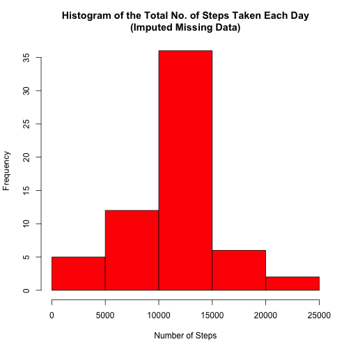
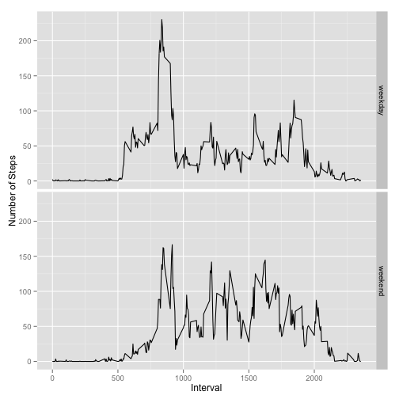

## Loading and preprocessing the data


```r
data <- read.csv("activity.csv", colClasses=c("numeric", "Date", "numeric"))
```

## What is mean total number of steps taken per day?


```r
library(plyr)
sum_steps <- ddply(data,c("date"),summarize,total_steps=sum(steps))
hist(sum_steps$total_steps,
     xlab = "Number of Steps",
     main = "Histogram of the Total No. of Steps Taken Each Day",
     col="yellow")
```

 

```r
mean_ <- mean(sum_steps$total_steps, na.rm = T)
median_ <- median(sum_steps$total_steps, na.rm = T)
```
The mean total number of steps taken per day is 1.0766189 &times; 10<sup>4</sup>.
The median total number of steps taken per day is 1.0765 &times; 10<sup>4</sup>.

## What is the average daily activity pattern?


```r
library(plyr)
mean_data <- ddply(data,
                   c("interval"),
                   summarize,
                   mean_steps=mean(steps, na.rm = T))

plot(mean_data$interval,
     main = "Time Series Plot of the 5-Minute Interval\nand the Average No. of Steps Taken\n(Across All Days)",
     mean_data$mean_steps,
     ylab = "Ave. No. of Steps Taken", xlab = "5-Minute Interval", type="l")
```

 

```r
max_row <- mean_data[mean_data$mean_steps == max(mean_data$mean_steps), ]
max_5 <- max_row[, c("interval")]
max_5_val <- max_row[, c("mean_steps")]
```

835 is the 5-min interval that contains the maximum number of steps, with the value
of 206.1698113 (on average across all the days).

## Imputing missing values


```r
na_count <- nrow(data) - nrow(na.omit(data))
```
The total number of missing values in the dataset is 2304.


```r
library(plyr)
new_data <- transform(data, 
                      steps = ifelse(is.na(steps), 
                                     floor(ave(steps,
                                               interval,
                                     FUN = function(x) mean(x, na.rm = TRUE))), 
                                     steps))

new_na_count <- nrow(data) - nrow(na.omit(new_data))

new_sum_steps <- ddply(new_data,.(date),summarize,total_steps=sum(steps, na.rm = F))

hist(new_sum_steps$total_steps,
     xlab = "Number of Steps",
     main = "Histogram of the Total No. of Steps Taken Each Day\n(Imputed Missing Data)",
     col="red")
```

 

```r
new_mean <- round(mean(new_sum_steps$total_steps, na.rm = T), 2)
new_median <- round(median(new_sum_steps$total_steps, na.rm = T), 2)
```

The new mean total number of steps taken per day is 1.074977 &times; 10<sup>4</sup>.
The new median total number of steps taken per day is 1.0641 &times; 10<sup>4</sup>.
Both of these are different from the first computed values with still missing data.
The imputation affected the estimates of the total daily number of steps,
thus adding more amount of information available for the analysis.

## Are there differences in activity patterns between weekdays and weekends?

### "Time Series Plot of the 5-Minute Interval and the Average No. of Steps Taken
### (Across All Weekend or Weekday Days)"


```r
library(plyr)
library(ggplot2)

new_data$weekDayEnd <- ifelse(!weekdays(as.Date(new_data$date)) %in% c("Saturday", "Sunday"),
                              "weekday", "weekend")

n_data <- ddply(new_data, c("interval","weekDayEnd"), summarize, mean_steps=mean(steps))

print(ggplot(n_data, aes(interval, mean_steps)) + 
      geom_line() + 
      facet_grid(weekDayEnd~.) + 
      xlab("Interval") +
      ylab("Number of Steps"))
```

 

